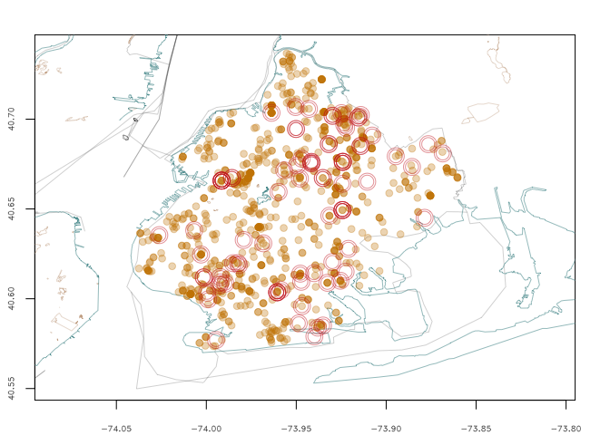

### contents

- [basic mapping in R with NYC Open Data](https://github.com/mozzarellaV8/nyc-pigeons#basic-mapping-in-r-with-nyc-open-data)
- [how this came about](https://github.com/mozzarellaV8/nyc-pigeons#how-this-came-about)
- [further research](https://github.com/mozzarellaV8/nyc-pigeons#further-research)
- [further thoughts](https://github.com/mozzarellaV8/nyc-pigeons#further-thoughts) 
- [sources and resources](https://github.com/mozzarellaV8/nyc-pigeons#sources-and-resources)

the meat: 
- [process and plots](nyc311-Pigeons.md)

### Basic Mapping in R with NYC Open Data

_Mapping the pigeon complaints of New York City, 2010 - early 2016_

This is a little side project from my class 
[Foundations of Data Science](https://www.springboard.com/workshops/data-science). It's done in R, to explore the spatial libraries and work with shapefiles, as well as publicly available data from New York City. 

``` r
pigeon <- read.csv("~/Github/nyc-pigeons/data/contains_pigeon.csv")
summary(pigeon$Descriptor)
```
	       N/A  Pigeon Odor Pigeon Waste 
           1          	312         3580

An example plot of Brooklyn - 

- Pigeon Waste complaint coordinates in orange.
- Pigeon Odor complaint coordinates in red.



All plots and process: [nyc311-Pigeons.md](https://github.com/mozzarellaV8/nyc-pigeons/blob/first/nyc311-Pigeons.md)

### how this came about~

I came across a dataset in Jeremy Singer-Vine's [weekly email](https://tinyletter.com/data-is-plural), comprised of all reported rat sightings in New York City. Going further I found a _wealth of data_ on complaints made to various NYC agencies, all through the 311 Service Requests system. [NYC Open Data](https://nycopendata.socrata.com/data) is a beautiful thing.

Filtering the data from the source using Socrata's API - limiting the results to _311 Service Requests - contains 'pigeon'_ - we have 3893 observations of 30 variables. Since [rats of New York have been amazingly well analyzed](http://www.ncbi.nlm.nih.gov/pmc/articles/PMC4157232/) - why not see what we can learn about pigeons?


### further research

to do:

- [rgdal](https://cran.r-project.org/web/packages/rgdal/rgdal.pdf) - OGR, ShapePolys, accuracy
- [Spatial data in R: Using R as a GIS](https://pakillo.github.io/R-GIS-tutorial/) - PROJ.4 and CRS, googleVis, general workflow
- [Spatial Reference](http://www.spatialreference.org/) - reference for PROJ.4, more
- [Introduction to visualising spatial data in R](https://cran.r-project.org/doc/contrib/intro-spatial-rl.pdf) - structure of spatial data in R

to look into: 

- [Pigeon Keepers of NYC](http://www.dailymail.co.uk/news/article-2184738/Meet-pigeon-keepers-NYC-Men-practise-centuries-old-art-birds-precious-pesky.html) - article from England
- [Pigeon Kings of Brooklyn](http://www.imdb.com/title/tt2294767/fullcredits/) - documentary from 2015
- [Cosa Nosta News](http://www.cosanostranews.com/2014/07/spero-bred-racing-pigeons-and-gangsters.html) - hobbies of organized crime leaders. Bath Avenue, Bensonhurst. 
- [Brooklyn In Flight](http://fort-greene.thelocal.nytimes.com/2010/01/15/jewels-of-the-rooftop/) - pigeon loft in Clinton Hill/Ft. Greene/Bed-Stuy. Also: Broadway Pigeons & Pet Supply at 1622A Broadway, Brooklyn. 

### further thoughts

###### on pigeons:

-   where are all the licensed street food vendors in NYC?
-   what is it about certain parts of bridges that get pigeons to congregate?
-   what is pigeon odor?
-   who calls more than once a day and why? are pigeons really the problem?
-   other items to look at: waterfront access, natural resources, public health, urban architecture and infrastructure typologies.

###### on policy:

- how much waste warrants a call to 311?
- as with many 311 calls, many complaints are lodged from the area surrounding Central Park. 
In regard to pigeons specifically, does the historic and high rise architecture surrounding the park come into play?
- how much waste warrants a legitimate threat to health? 
- beyond the Upper East/West sides, who calls the most about waste? about odor?
- what does this odor smell like? 

###### on programming:

-   would it be nice to wrap some of these code chunks in functions?
-   aside from bounding boxes coordinates for specific boroughs, could the shapelines be called from a function?
-   how do you write code for something less specific than pigeon complaints? i.e. something adaptable to many parts of NYC Open Data? 

###### observations since making these maps:

-   saw a dangling sign (another 311 complaint) covered in pigeon shit
-   sometimes anti-pigeon spikes are placed on top of decorative religious statues
-   pay a visit to some of the rootop pigeon farms of Brooklyn?
-   when do the competetive pigeon races take place?


### sources and resources

- [NYC Open Data](https://nycopendata.socrata.com/)
- [nyc.gov](http://www1.nyc.gov/site/planning/data-maps/open-data/districts-download-metadata.page)
- [Flowing Data tutorials](http://flowingdata.com) - are really great.
- [Data is Plural](https://tinyletter.com/data-is-plural)
- my mentor Julian for my [Foundations of Data Science](https://www.springboard.com/workshops/data-science) class
- [Open Street Map](http://openstreetmapdata.com/)
- [I Quant NY](http://iquantny.tumblr.com/) - man, so good.

